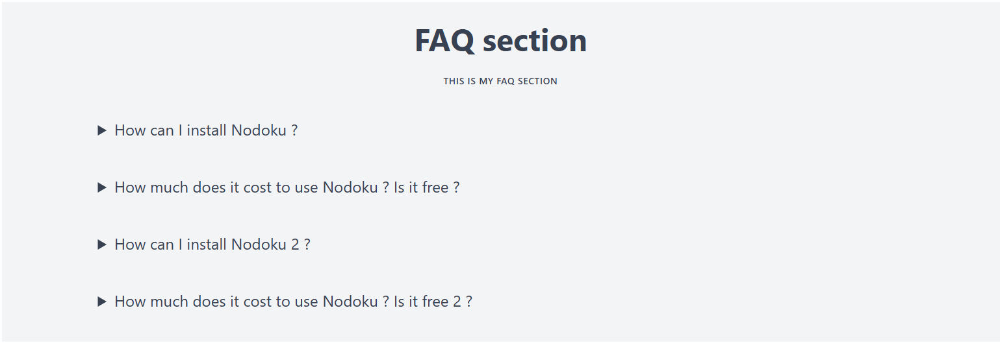

<!-- TOC -->
* [Getting started](#getting-started)
* [The _nodoku-flowbite_ components](#the-_nodoku-flowbite_-components)
  * [flowbite/card](#flowbitecard)
  * [flowbite/horizontal-card](#flowbitehorizontal-card)
  * [flowbite/jumbotron](#flowbitejumbotron)
  * [flowbite/carousel](#flowbitecarousel)
<!-- TOC -->

**_nodoku-mambaui_** is a set of visual components to be used with the [Nodoku static site generator](https://github.com/nodoku/nodoku-core).

The components provided in the **_nodoku-mambaui_** library are based on [Mamba UI set of components](https://mambaui.com/).

The components in the nodoku-flowbite library are styled using Tailwind CSS.

All the Nodoku components support localization out of the box. 

One needs to provide the i18n provider parameter to the Nodoku root component - RenderingPage.

See [nodoku-i18n](https://github.com/nodoku/nodoku-i18n) for more details 

# Prerequisites

Please have a look at the following links for general information about using the Nodoku component bundles

[Getting started](https://github.com/nodoku/nodoku-flowbite?tab=readme-ov-file#getting-started)

[Component's default theme](https://github.com/nodoku/nodoku-flowbite?tab=readme-ov-file#components-default-theme)

[Nodoku skin component customization](https://github.com/nodoku/nodoku-flowbite?tab=readme-ov-file#nodoku-skin-component-customization)

# The _nodoku-mambaui_ components

The package nodoku-mambaui contains currently the following components.

## mambaui/hero-one

<figure>
  
  <figcaption>
    Nodoku <b>mambaui/hero-one</b> component
  </figcaption>
</figure>

## mambaui/hero-two

<figure>
  
  <figcaption>
    Nodoku <b>mambaui/hero-two</b> component
  </figcaption>
</figure>

## mambaui/hero-left-text

<figure>
  
  <figcaption>
    Nodoku <b>mambaui/hero-left-text</b> component
  </figcaption>
</figure>

## mambaui/hero-right-text

<figure>
  
  <figcaption>
    Nodoku <b>mambaui/hero-right-text</b> component
  </figcaption>
</figure>

## mambaui/faq-header and mambaui/faq-one-question

<figure>
  
  <figcaption>
    Nodoku <b>mambaui/faq-header and mambaui/faq-one-question</b> component
  </figcaption>
</figure>

## mambaui/card

<figure>
  
  <figcaption>
    Nodoku <b>mambaui/card</b> component
  </figcaption>
</figure>

