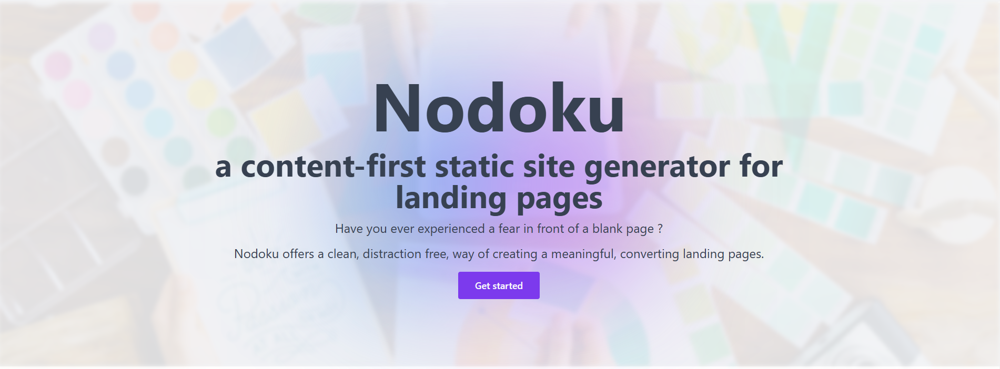
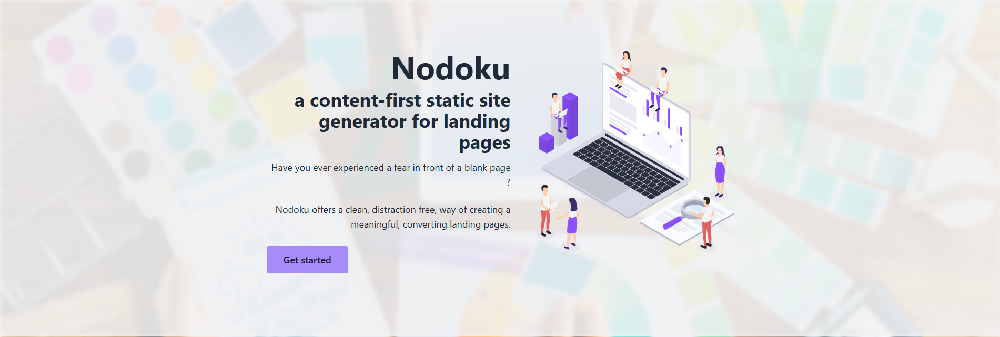
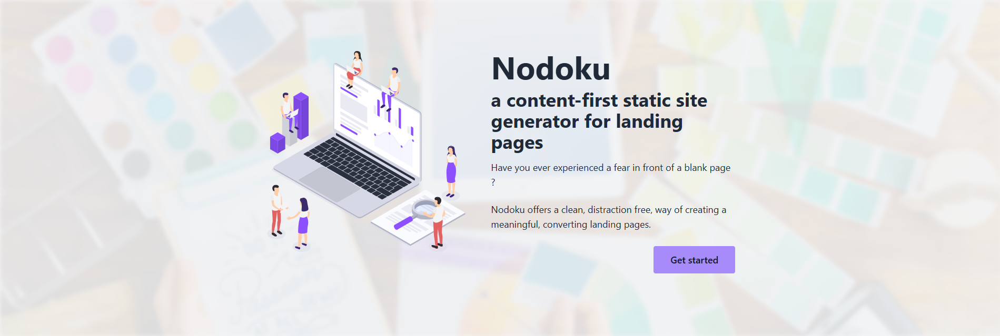
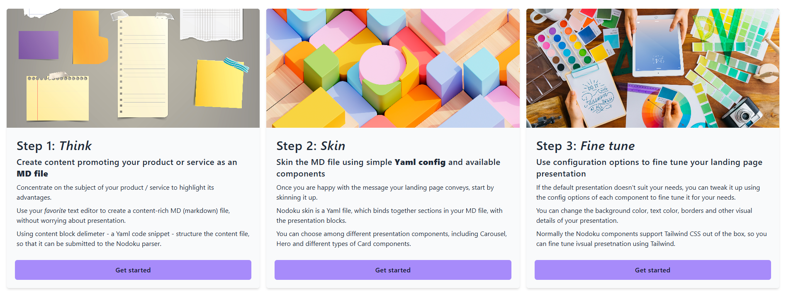

<!-- TOC -->
* [Prerequisites](#prerequisites)
* [The _nodoku-mambaui_ components](#the-_nodoku-mambaui_-components)
  * [mambaui/hero-one](#mambauihero-one)
  * [mambaui/hero-two](#mambauihero-two)
  * [mambaui/hero-left-text](#mambauihero-left-text)
  * [mambaui/hero-right-text](#mambauihero-right-text)
  * [mambaui/faq-header and mambaui/faq-one-question](#mambauifaq-header-and-mambauifaq-one-question)
  * [mambaui/card](#mambauicard)
* [Nodoku license](#nodoku-license)
  * [Use for private, educational or commercial needs, excluding applications for webpage or website building tools](#use-for-private-educational-or-commercial-needs-excluding-applications-for-webpage-or-website-building-tools)
  * [Use as part of website or webpage builders](#use-as-part-of-website-or-webpage-builders)
* [Examples](#examples)
  * [Proper use, free of charge, under the MIT License](#proper-use-free-of-charge-under-the-mit-license)
  * [Prohibited use](#prohibited-use)
<!-- TOC -->

**_nodoku-mambaui_** is a set of visual components to be used with the [Nodoku static site generator](https://github.com/nodoku/nodoku-core).

The components provided in the **_nodoku-mambaui_** library are based on [Mamba UI set of components](https://mambaui.com/).

The components in the nodoku-flowbite library are styled using Tailwind CSS.

All the Nodoku components support localization out of the box. 

One needs to provide the i18n provider parameter to the Nodoku root component - RenderingPage.

See [nodoku-i18n](https://github.com/nodoku/nodoku-i18n) for more details 

# Prerequisites

Please have a look at the following links for general information about using the Nodoku component bundles

[Getting started](https://github.com/nodoku/nodoku-flowbite?tab=readme-ov-file#getting-started)

[Component's default theme](https://github.com/nodoku/nodoku-flowbite?tab=readme-ov-file#components-default-theme)

[Nodoku skin component customization](https://github.com/nodoku/nodoku-flowbite?tab=readme-ov-file#nodoku-skin-component-customization)

# The _nodoku-mambaui_ components

The package nodoku-mambaui contains currently the following components.

## mambaui/hero-one

<figure>
  
  <figcaption>
    Nodoku <b>mambaui/hero-one</b> component
  </figcaption>
</figure>

## mambaui/hero-two

<figure>
  
  <figcaption>
    Nodoku <b>mambaui/hero-two</b> component
  </figcaption>
</figure>

## mambaui/hero-left-text

<figure>
  
  <figcaption>
    Nodoku <b>mambaui/hero-left-text</b> component
  </figcaption>
</figure>

## mambaui/hero-right-text

<figure>
  
  <figcaption>
    Nodoku <b>mambaui/hero-right-text</b> component
  </figcaption>
</figure>

## mambaui/faq-header and mambaui/faq-one-question

<figure>
  
  <figcaption>
    Nodoku <b>mambaui/faq-header and mambaui/faq-one-question</b> component
  </figcaption>
</figure>

## mambaui/card

<figure>
  
  <figcaption>
    Nodoku <b>mambaui/card</b> component
  </figcaption>
</figure>

# Nodoku license

The Nodoku License to be used depends on the use case you plan to use Nodoku for:

- using Nodoku to build an End Product, which is a webpage or a website for private or commercial use
  - in short, in this case Nodoku **_is free_** to use under the MIT License (see below for more details)
- using Nodoku to build an End Product, which is a webpage or a website builder (online or offline)
  - in short, in this case the use of Nodoku **_is prohibited_**

Note, that
> in any case of the allowed, free-of-charge use of Nodoku, **_the present Nodoku license should be included in all copies of the Software, using Nodoku_**.

## Use for private, educational or commercial needs, excluding applications for webpage or website building tools

Any use of Nodoku, **_except for webpage and website builder applications_**, is allowed free of charge, under the **_MIT license_** ( see the [LICENSE](./blob/main/LICENSE) )

## Use as part of website or webpage builders

The use of Nodoku for the purposes to provide a solution for online (or offline) website or webpage builders is **_prohibited_**.

This prohibition includes the direct or indirect use of the Nodoku library as part of webpage builder solution.

Indirect use of Nodoku library would include building a software or a framework that would then be used as part of webpage or website builder.

Webpage or Website builder application is any tool, online or offline, that would allow the End User to build a publishable webpage or website, using no code or low amount of code.

This is prohibited under this license term since that would constitute a direct competition to Nodoku lo-code site builder.

# Examples

## Proper use, free of charge, under the MIT License

- building a webpage or a website for a private non-commercial project
- building a webpage or a website for a private commercial project
- building a webpage or a website for a public commercial or non-commercial blog
- building a webpage or a website for a client, that would use it for commercial or non-commercial purposes
- creating and distributing non-commercially (free of charge) custom Nodoku components
- creating and distributing commercially custom Nodoku components (developing and selling out new Nodoku-compatible UI components)
- developing new UI components and selling them out either as a Nodoku component, or a standalone component, or a component compatible with another website builder

## Prohibited use

- building a website builder, that would use the Nodoku engine to provide the End User with a tool, that would allow them building their own webpages or websites
- using Nodoku engine to provide the End User with an automatic, semi-automatic or manual framework, that would allow them building their own webpages or websites
- using Nodoku libraries to use it as part of the solution that would allow the End User to build a webpage or a website
